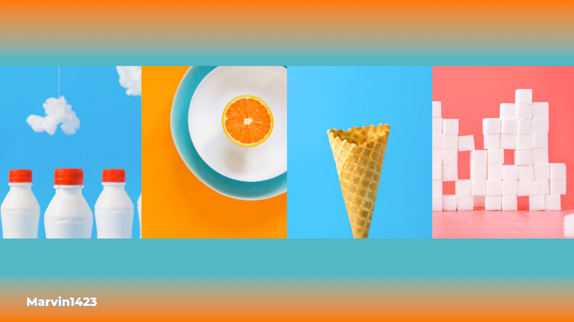

# 🚀 Sunnyside Agency

<h2>🔗 Page link</h2>

Link for visualization and testing of the page: 👉 <a href="https://github-user-api-mu.vercel.app/" target="_blank">Sunnyside Agency</a>

 ## ⚙️ Developed skills:
  
-   |HTML: Use of semantic tags, and responsive html building utlizing `<picture>`.

-  | Flexbox and grid: Element adjusting on the screen and use of responsive styles.

-  | Javascript: using js for responsive menu.

<h2>📐 Responsive page ✂️</h2>

The project presents responsive layout for all the devices

<ul>
    <li>Desktop 🖥️</li>
    <li>Tablet 💻</li>
    <li>Smartphone 📱</li>
</ul>

